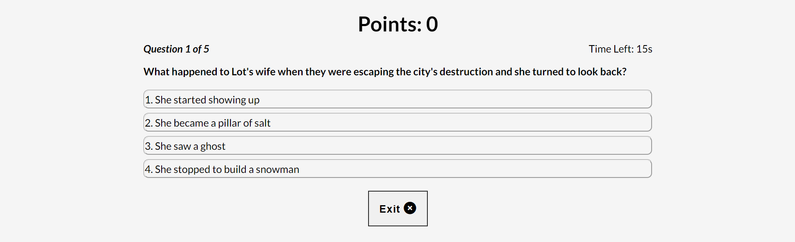
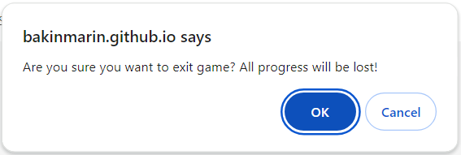

# Bible Quiz

## A Bible Quiz based Website
> The Bible Quiz is an interactive and educative knowledge-based quiz game centered on the Bible.

> Questions are on topics from both the Old and New Testaments - with a focus on showcasing some of the weird and wonderful stories told in scripture.

> On loading the game, the user is shown a list of instructions to better understand the rules of the game and must then commence game mode by clicking on the 'Start' button.

> The user must play against a clock, and then select the correct answer from four options and is awarded 100 points for each correct answer.

#### - Designed and Developed by Bola Akinmarin

## **[Live site](https://bakinmarin.github.io/bible-quiz-game/)**

------------------------------------------------------------------

## **[Repository](https://github.com/BAkinmarin/bible-quiz-game/tree/main)**

------------------------------------------------------------------
  
## Table of contents

 1. [ UX ](#ux)
 2. [ Features ](#features)  
 3. [ Features Left to Implement ](#left)  
 4. [ Technology used ](#tech) 
 5. [ Testing ](#testing)  
 6. [ Bugs ](#bugs)  
 7. [ Deployment](#deployment)
 8. [ Credits](#credits)
 9. [ Content](#content)  
 10. [ Acknowledgements](#acknowledgements)  

## UX

### Pre-project Planning

> For my project portfolio 2 I decided early on that I wanted to create a scripture based quiz game that would be interactive, educational and based on interesting stories. As a Christian, this theme is close to my heart and a means of creating awareness on how interesting and intriguing the Bible is.

> When deciding on the type of questions to include in the quiz, I went with both Old and New Testament, leaning heavily on the Old Testament to highlight some of the descriptions of people around in those times that led interesting lives or had distinguishing features.

> I also wanted to include a countdown timer to truly test the knowledge base of the user and a scoring system that told the user how many questions they got right. I also wanted to add in the educational piece by revealing the scripture from whence each question was inspired. 

# UX design

##### Favicon
I used a Bible emoji for the favicon as I felt this would be appropriate for the theme.

##### Color
I did not want to detract too much from the educative purpose of The Bible Quiz but I also wanted it to be engaging and interactive for the user so much so that they would be willing to play multiple times.

For this reason, I kept the color scheme clean and instead focused more on responsiveness and animating responses to user game activity.

##### Font
In keeping with a physical Bible - as well as most digital versions - I wanted to provide users with a clean interface and a clear legible font that would not impact on readability. This inspired the decision to go with Lato : sans-serif.

##### Emojis
In this project, and in keeping with the clean theme, I opted for the use of two emojis which are used in a modal display relative to if the user gets the question right or wrong.

##### Audio
In this project, to add to the user experience, I have included audio feedback for when the user gets the answer right and when the user gets the answer wrong.

## User Stories

### User
> As a user, I want to be able to play an interactive and educative game.

> As a user, I want to be able to learn about the Bible in a fun way.

> As a user, I want to be aware of the rules of the game before I play.

> As a user, I want to be rewarded for every right answer provided. 

> As a user, I want to be able to play without being interrupted by advertisements.

> As a user, I want to be able to replay the game and beat my previous score.

## Wireframes

### Desktop & Mobile Design

## Features

### index.html

#### Welcome Page

In my initial design, I envisaged three HTML files and two JavaScript files to keep the questions array separate from the JavaScript code. 

However, during the project inception call with my mentor, I discovered that it was possible to execute the entire game in a single HTML file using DOM manipulation.

I went with this concept, ending with a single index.HTML page incorporating separate sections for Quiz Rules, Quiz Game and Final Score.

#### Quiz Area

 1. The game starts the user off on the 'Quiz Rules' page displaying a set of game rules and a 'Play Quiz' button to start game.
 2. When the user clicks the 'Play Quiz' button, the 'Quiz Rules' page is hidden and the user is presented with the first multiple choice question.
 3. When the user selects their answer, the selection turns green if correct or red if incorrect and their score is incremented accordingly.
 4. Immediate feedback is provided to the user via a modal after each selection. The modal, which includes a prompt for the user to click 'Next' to move on to the next question - also includes the corresponding Bible verse.
 5. Once the final question has been answered, the 'Quiz Page' is replaced with the 'End Game' page which reveals the users final score and a 'Replay Quiz' option.

#### Answer Modal

#### Countdown TImer
> I decided to include a countdown timer as I wanted users to have an effective way of evaluating their Bible knowledge.

>The countdown timer begins counting down when a question is presented to the user, displaying how long they have left to answer the question.

> If the user does not answer in time defined, they will receive a feedback response briefly before moving on to the next question.

> If the user has not answered the maximum number of questions assigned, the next question is presented to the user, alternatively, the 'End Game' function is called and the user is shown their final score. 

#### End Game

The 'End Game' function is called when there are either no questions left in the list or if the user reaches the max-question count. 
Once this happens, the end game function calls displaying the users final score.

#### Exit Game

The 'Exit Game' button calls the exit game function which displays a window alert to the user, giving them the option to confirm their intention to leave the game and lose their progress. If the user selects 'OK' the exit game function promptly terminates the game and displays the final score page to the user otherwise, the user returns to last known position in the game.

# Features Left to implement

> Option for user to input username to feed into High Scores dashboard which is saved in local storage so multiple users can compare scores and track progress.

> Audio feedback corresponding to other user game interactions for an enhanced user experience.

### Additional ideas
> Create and add option for user to choose quiz game based on one of the 66 Books of The Bible.

> Separate Sections for Old and New Testament, giving user the option to play quiz game based on preference. 

> Create and add Parable of Jesus Section, giving user the option to play quiz based on this option.

> Create and add Creation Story Section, giving user the option to play quiz based on this option.

> Create and add Easy, Medium and Hard levels, giving user the option to select difficulty. 

> Create and add a Rewards Section where users are awarded tokens named after the Fruits of The Holy Spirit - based on number of points collected as they move through the 66 Books of THe Bible Quiz option.

# Technology Used

### HTML
> The backbone of website design and function; used to provide structure to the website.

### CSS
> Used to style the layout of each web page.

### Javascript
> Used to make the site dynamic and to present, select and store the users answers and then provide a score based on the time it took them to answer.

### Font Awesome
> Source of all the icons used in this project.

### Google Fonts
> Used to define the fonts used in the project. Also used to compare and pair font-styles.

### Favicon.io
> Used to generate a favicon for the existing logo.

### JavaScript Audio Function
> Used to provide audio feedback to user corresponding to right or wrong asnwer.

# Testing

### Testing Phase

#### Manual Testing

| Test | Result |
|--|--|
|Rules are comprehendable|Pass|
|When Play Quiz is selected, game starts| Pass |
|When user selects an answer, answer modal comes pops up with description|Pass|
|The answer modal closes and user is presented with next question when user clicks the next button|Pass|
|When game starts clock begins countdown|Pass|
|When user selects answer, new question and answers are pulled|Pass|
|When new question is called the clock restarts|Pass|
|The correct answers appear with the correct questions|Pass|
|When the user answers a question the question counter increases|Pass|
|When the user answers the final question the game directs to the end game|Pass|
|The end game page displays the users final score|Pass|
|When the user clicks Replay they are redirected to the rules page|Pass|

### User testing

#### Third Party Review

> Only noticable issue reported was a typo on one of the answers in the Quiz.

#### User tests

> Three users were asked to attempt the following and their scores were averaged to give the below scores
 
|Test|Result  |
|--|--|
|Read the rules to understand the game |100%|
|Check time is appropriate for user to read correct answer description |100%|
|Check user can navigate to next question when previous question has been answered |100%|
|Check user can exit game as and when they want |100%|
|Check user can replay the game |100%|

## Google Lighthouse Testing

### Desktop

### Mobile

## HTML W3 Validation

### index.html

#### Result: No Errors

### CSS Validation

#### Result: No Errors

### JS Hint Checker

#### Result: 34 warnings (topics shown below) - ignored as code renders and expected and has been fully tested:
> 'arrow function syntax (=>)' is only available in ES6 (use ''esversion: 6')
> 'spread operator' is only available in ES6 (use 'esversion: 6')
> 'template literal syntax' is only available in ES6 (use 'esversion: 6')
> 'unexpected use of unicode'

## **Bugs**

> Unable to get user selection to turn green when correct and red when incorrect. **Fixed**

> Unable to display 'Hidden Verse' description to highlight the corresponding scripture which inspired question. **Fixed**

> Unable to get Next Question option to work properly. **Fixed**

> Unable to get user selection to turn green / red relative to answer prior to window alert. **Fixed**

## Deployment

> To deploy the project I followed these steps starting from the main project repository linked above.

 1. Clicked on `Settings` on the navigation menu in the repository
 2. I then selected the `Pages` menu on the side bar.
 3. In the first dropdown menu labeled `Source` I selected the branch of the name `main` from the dropdown.
 4. In the next dropdown labeled `/root` I left as the default option.
 5. Selected Save.
 
> I then received a notification from GitHub that my project is being deployed and after about 2 minutes and a couple of refreshes of the page it was ready and live.

## Credits

### [Brian Design](https://www.youtube.com/watch?v=f4fB9Xg2JEY&t=352s) - YouTube
> Step-by-step tutorial on creating a quiz using HTML, CSS and JavaScript. Inspired the use of Arrow syntax in some function definitions.

### [PRAROZ](https://www.youtube.com/watch?v=1ydfKDwsYbU) - YouTube
> Step-by-step tutorial on creating a quiz using HTML, CSS and JavaScript. 

> Particularly useful with understanding the concept of working with countdown timers.

### [James Q Quick](https://www.youtube.com/watch?v=rFWbAj40JrQ&list=PLB6wlEeCDJ5Yyh6P2N6Q_9JijB6v4UejF) - YouTube
> Step-by-step tutorial used for inspiration on checking user answers.

### [LIVE BLOGGER](https://www.youtube.com/watch?v=J3VxEGcc7Zw) - YouTube
> Another step-by-step tutorial on creating a quiz using HTML, CSS and JavaScript.

### [Web Dev Simplified](https://www.youtube.com/watch?v=riDzcEQbX6k) - YouTube
> Detailed step-by-step tutorial on creating a quiz game using HTML, CSS and JavaScript.

## Content & Resources

### NotSoBoringBible.com
> Used for quiz questions included in project.

### w3 schools
> Used when researching how to use and style a modal.

### Stack Overflow
> Used to query issues relating programming issues relating to injecting html with JS.

### Youtube.com
> Channels like **Coding Nepal**, **Brian Design** and **James Q Quick** helped understand different JS concepts throughout this project.

> Also helped broaden my understanding of manipulating the DOM more effetively.

### Code Institute
> Project created in line with course content, walkthrough project and and within project 2 scope.

### [User Feedback](https://www.freesoundslibrary.com/?s=tada) - Correct
> Feedback sound when user gets a question right.

### [User Feedback](https://www.freesoundslibrary.com/nope-sound-effect/) - Incorrect
> Feedback sound when user gets a question wrong.

## Acknowledgements

### Alan Bushell
> My mentor who helped keep me on track when overthinking things and provided positive reinforcement where applicable.